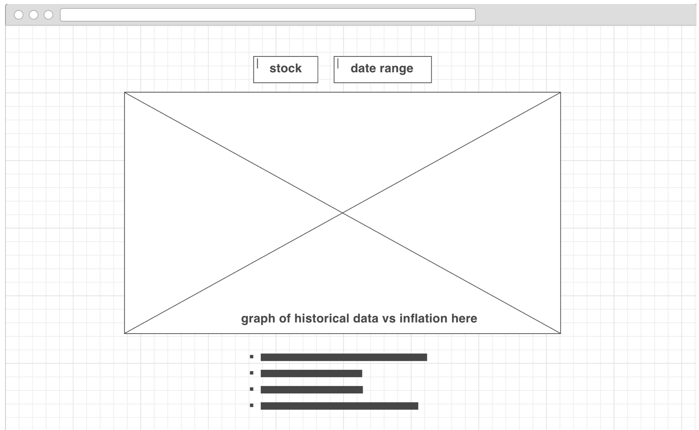

# Introduction
This application is an analysis of current and historical US stock prices against inflation. The purpose is to provide this information to the public for purposes of research, and for statisticians to build predictive models for each stock and each price point. The stock data are pulled from Quandl's API, and compared against StatBureau's inflation API. The data will be presented graphically using ChartJS, and the application will be built on a Rails server.

View the application [HERE](https://stock-history.herokuapp.com)!!

# User Stories
- As a user, I should be able to search any publicly traded company on the major exchanges (NYSE, NASDAQ, S&P 500)
- As a user, I should be able to see the price of the stock at any point in history (most data covers the past 20-40 years, daily)
- As a user, I should be able to select a date, see the price of the stock at that date, and see if it's over or undervalued compared to the price of the stock today
- As a user, I should be able to save favorite stocks to track over time.

# APIs Used
- [Quandle](https://www.quandl.com/tools/api)
- [StatBureau](https://www.statbureau.org/en/inflation-api)

# Wireframes

